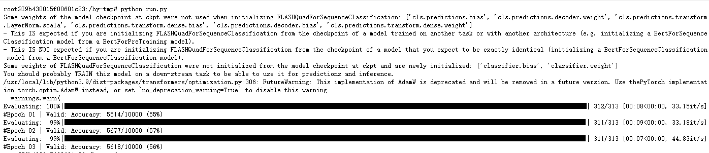

# FLASHQuad_pytorch
pytorch implement of FLASHQuad

# Describtion
个人实现`pytorch`版本的[《Transformer Quality in Linear Time》](https://arxiv.org/abs/2202.10447)

# 存在的问题
- `A = square(relu(qk / seq_len + bias))`感觉不对劲，假设训练的时候都是在seq_len=512的长度上进行的，如果预测的时候seq_len=16时，A的结果会发生很大的变化。
- `embedding`部分和`MLM head`不确定是否使用的是`ScaleNorm`，不确定是否使用到`dropout`。
- 发现当前代码训练出来的模型结果不理想，`n-1`层的输出和`n`层的输出差距不大。


# 更新
- 2022/03/01 使用带有`mlm_acc`的`Trainer`，训练过程中可以监控训练集`每logging_steps`的MLM准确率。
- 2022/02/28 添加[checkpoint-170000的small权重](https://huggingface.co/junnyu/flashquad_small_wwm_cluecorpussmall)，[训练日志1](https://wandb.ai/junyu/huggingface/runs/ofdc74wr)和[训练日志2](https://wandb.ai/junyu/huggingface/runs/2ep6cl14)，感觉结果不理想。
- 2022/02/26 修改了`rel_pos_bias`部分的代码,发现之前的代码会出现输出异常(训练是在512长度进行的,在别的长度进行测试,模型的输出会出问题. )
```python
    # 之前的代码.
    bias = self.rel_pos_bias(seq_len)
    kernel = torch.square(torch.relu(qk / seq_len + bias))
    # 更新后的代码.
    self.max_position_embeddings = 512
    bias = self.rel_pos_bias(self.max_position_embeddings)[:, :seq_len, :seq_len]
    kernel = torch.square(torch.relu(qk / self.max_position_embeddings + bias))
```

# Usage
```python
from flash import FLASHQuadConfig, FLASHQuadModel
import torch
config = FLASHQuadConfig()
model = FLASHQuadModel(config)
model.eval()
input_ids = torch.randint(0,12000,(4,128))
with torch.no_grad():
    outputs = model(input_ids=input_ids, output_attentions=True, output_hidden_states=True)
    print(outputs)
# BaseModelOutput(last_hidden_state=tensor([[[-9.4036e-01,  2.7427e-01, -1.1174e-01,  ...,  2.1995e-01.....
```

# Pretrain
## 准备数据
## CLUECorpusSmall 数据集处理教程(摘抄自[paddlenlp](https://github.com/PaddlePaddle/PaddleNLP/blob/develop/examples/language_model/data_tools/README.md))
**数据集简介**：可用于语言建模、预训练或生成型任务等，数据量超过14G，近4000个定义良好的txt文件、50亿个字。主要部分来自于nlp_chinese_corpus项目
包含如下子语料库（总共14G语料）：新闻语料[news2016zh_corpus.zip](https://bj.bcebos.com/v1/ai-studio-online/6bac09db4e6d4857b6d680d34447457490cb2dbdd8b8462ea1780a407f38e12b?responseContentDisposition=attachment%3B%20filename%3Dnews2016zh_corpus.zip)， 社区互动语料[webText2019zh_corpus.zip](https://bj.bcebos.com/v1/ai-studio-online/83da03f7b4974871a52348b41c16c7e3b34a26d5ca644f558df8435be4de51c3?responseContentDisposition=attachment%3B%20filename%3DwebText2019zh_corpus.zip)，维基百科语料[wiki2019zh_corpus.zip](https://bj.bcebos.com/v1/ai-studio-online/d7a166408d8b4ffdaf4de9cfca09f6ee1e2340260f26440a92f78134d068b28f?responseContentDisposition=attachment%3B%20filename%3Dwiki2019zh_corpus.zip)，评论数据语料[comment2019zh_corpus.zip](https://bj.bcebos.com/v1/ai-studio-online/b66ddd445735408383c42322850ac4bb82faf9cc611447c2affb925443de7a6d?responseContentDisposition=attachment%3B%20filename%3Dcomment2019zh_corpus.zip)。

**数据集下载**：
用户可以通过官方github网页下载，https://github.com/CLUEbenchmark/CLUECorpus2020 。同时，为方便用户，我们也提供了aistudio数据集下载地址。[part1](https://aistudio.baidu.com/aistudio/datasetdetail/60598)，[part2](https://aistudio.baidu.com/aistudio/datasetdetail/124357)。使用aistudio版本的数据，下载好后，可以核对md5值：
```shell
> md5sum ./*
 8a8be341ebce39cfe9524fb0b46b08c5  ./comment2019zh_corpus.zip
 4bdc2c941a7adb4a061caf273fea42b8  ./news2016zh_corpus.zip
 fc582409f078b10d717caf233cc58ddd  ./webText2019zh_corpus.zip
 157dacde91dcbd2e52a60af49f710fa5  ./wiki2019zh_corpus.zip
```
(1) 解压文件
```shell
unzip comment2019zh_corpus.zip -d  clue_corpus_small_14g/comment2019zh_corpus
unzip news2016zh_corpus.zip    -d  clue_corpus_small_14g/news2016zh_corpus  
unzip webText2019zh_corpus.zip -d  clue_corpus_small_14g/webText2019zh_corpus
unzip wiki2019zh_corpus.zip    -d  clue_corpus_small_14g/wiki2019zh_corpus  
```
(2) 将txt文件转换为jsonl格式
```shell
python trans_to_json.py  --input_path ./clue_corpus_small_14g --output_path clue_corpus_small_14g.jsonl
mkdir data #创建data文件夹
mv clue_corpus_small_14g.jsonl ./data #将jsonl放进该目录
```
(3) 使用rjieba进行中文分词,会得到`data/refids.txt`和`data/reftext.txt`两个文件,并组合`data/refids.txt`和`data/reftext.txt`两个文件保存成`huggingface`的`dataset`
```shell
python run_chinese_ref.py  --model_name junnyu/roformer_chinese_char_base --input_path ./data/clue_corpus_small_14g.jsonl
```

## 开始训练(small版本模型)
```bash
TRAIN_DIR=./clue_small_wwm_data
OUTPUT_DIR=./wwm_flash_small/
BATCH_SIZE=32
ACCUMULATION=4
LR=1e-4
python run_mlm_wwm.py \
    --do_train \
    --tokenizer_name junnyu/roformer_chinese_char_base \
    --train_dir $TRAIN_DIR \
    --output_dir $OUTPUT_DIR \
    --logging_dir $OUTPUT_DIR/logs \
    --per_device_train_batch_size $BATCH_SIZE \
    --gradient_accumulation_steps $ACCUMULATION \
    --learning_rate $LR \
    --weight_decay 0.01 \
    --adam_epsilon 1e-6 \
    --max_steps 250000 \
    --warmup_steps 5000 \
    --logging_steps 100 \
    --save_steps 5000 \
    --seed 2022 \
    --max_grad_norm 3.0 \
    --dataloader_num_workers 6 \
    --fp16

```

# MLM测试(small版本模型checkpoint-170000)
```python
import torch
from flash import FLASHQuadForMaskedLM
from transformers import BertTokenizerFast
tokenizer = BertTokenizerFast.from_pretrained("junnyu/flashquad_small_wwm_cluecorpussmall")
model = FLASHQuadForMaskedLM.from_pretrained("junnyu/flashquad_small_wwm_cluecorpussmall")
model.eval()
text = "天气预报说今天的天[MASK]很好，那么我[MASK]一起去公园玩吧！"
inputs = tokenizer(text, return_tensors="pt")
with torch.no_grad():
    pt_outputs = model(**inputs).logits[0]

pt_outputs_sentence = "pytorch: "
for i, id in enumerate(tokenizer.encode(text)):
    if id == tokenizer.mask_token_id:
        val,idx = pt_outputs[i].softmax(-1).topk(k=5)
        tokens = tokenizer.convert_ids_to_tokens(idx)
        new_tokens = []
        for v,t in zip(val.cpu(),tokens):
            new_tokens.append(f"{t}+{round(v.item(),4)}")
        pt_outputs_sentence += "[" + "||".join(new_tokens) + "]"
    else:
        pt_outputs_sentence += "".join(
            tokenizer.convert_ids_to_tokens([id], skip_special_tokens=True))
print(pt_outputs_sentence)
# pytorch: 天气预报说今天的天[气+0.9948||空+0.0011||色+0.0007||候+0.0004||势+0.0003]很好，那么我[就+0.4915||们+0.4186||也+0.0753||还+0.0021||都+0.0016]一起去公园玩吧！
```

# Tnews分类
<p align="center">
    
</p>

# Tips
不怎么确定实现的对不对，如果代码有错误的话，请帮我指出来，谢谢~
